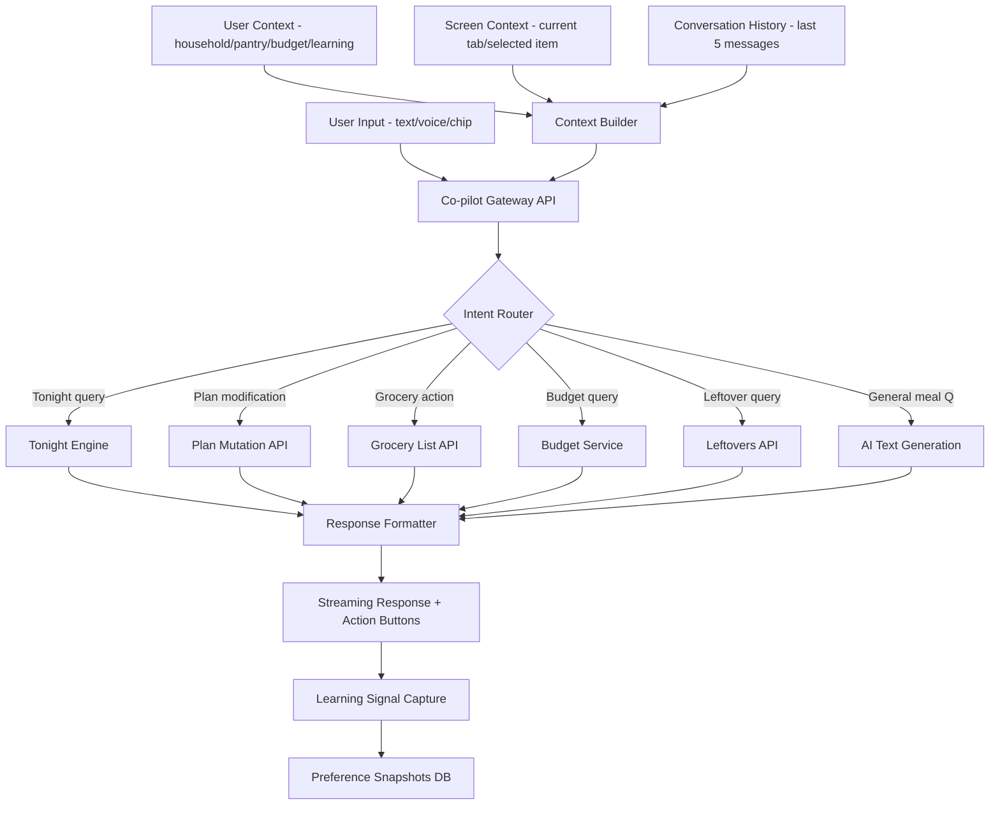

# MealEase Conversational AI Strategy

**Date:** May 15, 2026  
**Author:** AI Product Strategy  
**Scope:** Should MealEase build conversational AI, and if so, how?

---

## Table of Contents

1. [Should MealEase Build a Chatbot at All?](#1-should-mealease-build-a-chatbot-at-all)
2. [What Kind of Conversational AI Fits MealEase?](#2-what-kind-of-conversational-ai-fits-mealease)
3. [What Features Should Conversational AI Support?](#3-what-features-should-conversational-ai-support)
4. [What Should NOT Be Included?](#4-what-should-not-be-included)
5. [Best UX Pattern Recommendation](#5-best-ux-pattern-recommendation)
6. [How Conversational AI Can Improve Key Metrics](#6-how-conversational-ai-can-improve-key-metrics)
7. [How to Avoid Becoming Generic AI Chat](#7-how-to-avoid-becoming-generic-ai-chat)
8. [Ideal Architecture for Conversational Assistance](#8-ideal-architecture-for-conversational-assistance)
9. [Best Mobile-First Conversational UX](#9-best-mobile-first-conversational-ux)
10. [Final Recommendation & Implementation Phases](#final-recommendation--implementation-phases)

---

## 1. Should MealEase Build a Chatbot at All?

### The Honest Answer: Yes — But NOT a Chatbot

MealEase should build a **contextual conversational assistant**, not a chatbot. The distinction is critical:

| Aspect | Chatbot | Contextual Assistant |
|--------|---------|---------------------|
| Initiation | User must open chat | System surfaces at the right moment |
| Scope | Open-ended conversation | Bounded to current task + household context |
| Identity | "Ask me anything" | "I noticed something — want help?" |
| Mental model | Messaging app | Intelligent co-pilot |

### What Problem Would It Solve That the Current UI Doesn't?

The current MealEase UI excels at **structured decisions** (pick tonight's meal, generate a plan, scan fridge). But it struggles with:

| Gap | Example | Why Buttons Fail |
|-----|---------|-----------------|
| **Nuanced refinement** | "Make it spicier but keep it under 30 min" | Requires multi-parameter adjustment that's clunky with sliders |
| **Cross-feature queries** | "What can I make with Tuesday's leftovers that fits my budget?" | Spans leftovers + budget + recipe generation — no single screen handles this |
| **Ambiguous intent** | "Something easy, we're tired" | Low-energy mode exists but users don't know to toggle it |
| **Mid-flow corrections** | "Actually, swap Thursday — my in-laws are coming" | Currently requires navigating to planner, finding Thursday, regenerating |
| **Contextual questions** | "Is this recipe nut-free for my daughter?" | No way to ask about a specific meal's safety |
| **Voice-first scenarios** | Hands covered in flour, cooking in kitchen | Current UI requires touch interaction |

### Pros

- **Reduces cognitive load** — Users don't need to learn where every feature lives
- **Enables cross-feature intelligence** — The existing `cross-feature.ts` layer already connects Tonight ↔ Plan ↔ Budget ↔ Leftovers; conversation makes this visible to users
- **Captures implicit preferences** — "We loved that Thai curry last week" teaches the learning system without explicit rating
- **Differentiator** — No meal planning app has a household-aware conversational layer
- **Unlocks voice** — Kitchen is a hands-busy environment; voice needs a conversational interface

### Cons & Risks

| Risk | Severity | Mitigation |
|------|----------|------------|
| Dilutes the focused 5-job experience | **High** | Strict scope boundaries — assistant only helps with the 5 jobs |
| Users expect ChatGPT-level capability | **Medium** | Clear personality + graceful "I can't help with that" responses |
| Increases API costs significantly | **High** | Use existing rule engine first, LLM only for genuine conversation; `gpt-4o-mini` for all chat |
| Adds complexity to an already-complex app | **Medium** | Ship as contextual overlay, not a new tab |
| Conversation history storage costs | **Low** | Keep only last 10 messages per session; summarize for learning |
| Latency frustrates users | **Medium** | Streaming responses + optimistic UI + pre-computed suggestions |

### Verdict

**Build it — as a contextual co-pilot, not a chat tab.** The existing AI infrastructure (unified context builder, model router, cross-feature signals, learning system) provides 80% of what's needed. The conversational layer is the missing **interaction paradigm** that connects these powerful backend systems to natural user intent.

---

## 2. What Kind of Conversational AI Fits MealEase?

### Pattern Comparison

| Pattern | Description | Fits MealEase? | Why / Why Not |
|---------|-------------|----------------|---------------|
| **Full Chat** | Dedicated chat screen, open-ended conversation | ❌ No | Makes MealEase feel like another ChatGPT wrapper; dilutes the focused experience |
| **Contextual Assistant** | Appears in-context on specific screens with relevant suggestions | ✅ Partial | Good for screen-specific help but misses cross-feature queries |
| **Embedded Co-pilot** | Persistent but minimal presence; expands when needed; aware of current screen + full household context | ✅✅ Best | Matches the "household food OS" vision; always available but never intrusive |
| **Floating Helper** | Bubble/FAB that opens a mini-chat | ⚠️ Risky | Can feel like generic customer support; but the form factor works on mobile |

### Recommendation: **Embedded Co-pilot with Contextual Triggers**

The ideal pattern combines:

1. **A persistent but minimal entry point** (bottom-sheet handle or subtle FAB)
2. **Proactive contextual suggestions** (system-initiated, not user-initiated)
3. **Screen-aware responses** (knows you're on the planner vs. grocery list)
4. **Bounded conversation** (max 5-8 turns per interaction, then resolves to action)

This is NOT a chatbot. It's an **intelligent assistant that speaks when spoken to, and occasionally nudges when it notices something useful.**

### Why Not Full Chat?

```
User mental model with Full Chat:
  "I can ask anything" → disappointment when it can't help with non-food topics

User mental model with Embedded Co-pilot:
  "This helps me with my meals" → delight when it proactively suggests something smart
```

The co-pilot pattern sets correct expectations through its bounded presence.

---

## 3. What Features Should Conversational AI Support?

### Mapped to the 5 Core Jobs

#### Job 1: "What's for dinner tonight?"

| Use Case | Why Conversation > Buttons |
|----------|---------------------------|
| "Something quick, we're exhausted" | Natural language captures mood; triggers low-energy mode without user knowing the toggle exists |
| "Like last week's Thai curry but with chicken instead" | Reference + modification is hard with filters |
| "What pairs well with the wine we bought?" | Novel cross-domain query |
| "Make it kid-friendly but not boring for adults" | Multi-constraint that's awkward as checkboxes |

**Co-pilot behavior:** After user views Tonight suggestions, co-pilot might say: *"Your leftover rice from Tuesday would go great with a stir-fry tonight — want me to find one?"*

#### Job 2: "What can I make from my fridge?"

| Use Case | Why Conversation > Buttons |
|----------|---------------------------|
| "I also have some herbs in the garden" | Additive context after scan |
| "Can I substitute the cream for something dairy-free?" | Contextual follow-up on a specific recipe |
| "What if I skip the oven — just stovetop?" | Constraint refinement |

**Co-pilot behavior:** After Snap & Cook results appear: *"I see you have eggs and spinach — want a quick frittata option too?"*

#### Job 3: "What's the plan this week?"

| Use Case | Why Conversation > Buttons |
|----------|---------------------------|
| "Swap Thursday — we're having guests, need something impressive" | Context-rich modification |
| "Make the week more Mediterranean" | Theme-level adjustment across multiple days |
| "Move the expensive meals to the weekend" | Budget-aware rebalancing |
| "We have soccer practice Tuesday and Thursday — keep those nights fast" | Schedule-aware constraints |

**Co-pilot behavior:** After autopilot generates a plan: *"I noticed you have chicken 3 times this week — want me to swap one for fish?"*

#### Job 4: "What do I do with leftovers?"

| Use Case | Why Conversation > Buttons |
|----------|---------------------------|
| "The roast chicken is getting dry — what can I still do with it?" | Quality-aware suggestion |
| "Can I freeze the leftover soup?" | Storage question |
| "Combine Tuesday's rice and Wednesday's veggies into something" | Multi-leftover combination |

**Co-pilot behavior:** Proactive nudge: *"Your pulled pork expires tomorrow — want a quick taco night recipe?"*

#### Job 5: "How much will it cost?"

| Use Case | Why Conversation > Buttons |
|----------|---------------------------|
| "Can we do this week under $80?" | Budget constraint on existing plan |
| "What's the cheapest swap for the salmon on Friday?" | Targeted budget optimization |
| "Add the ingredients to my grocery list but skip what I already have" | Cross-feature action |

**Co-pilot behavior:** When budget is tight: *"You're $12 over budget this week. Want me to suggest 2 swaps that save $15?"*

### Cross-Feature Queries (Unique to Conversation)

These queries span multiple features and are **impossible** with the current button-based UI:

- "Plan next week around the chicken I'm defrosting and the veggies expiring Friday"
- "What's the most budget-friendly way to use my leftovers this week?"
- "Show me what I need to buy if I keep Monday and Tuesday but change the rest"

---

## 4. What Should NOT Be Included?

### Hard Anti-Patterns

| Anti-Pattern | Why It's Dangerous | Example to Avoid |
|--------------|-------------------|------------------|
| **General knowledge Q&A** | Makes it feel like ChatGPT | "What's the capital of France?" |
| **Nutritional medical advice** | Liability + out of scope | "Is this safe for my diabetes?" |
| **Recipe creation from scratch** | Unreliable, untested recipes | "Invent a new fusion dish" |
| **Open-ended cooking education** | Scope creep, not the product's job | "Teach me knife skills" |
| **Social/emotional conversation** | Uncanny, inappropriate | "How was your day?" |
| **Multi-turn storytelling** | Wastes tokens, no value | Long back-and-forth with no action |
| **Comparison shopping** | Out of scope, needs real-time pricing | "Where's chicken cheapest near me?" |
| **Restaurant recommendations** | Different product category | "Where should we eat tonight?" |

### Features That Would Make It Feel Generic

| Feature | Why It Fails for MealEase |
|---------|--------------------------|
| Persistent chat history visible as a timeline | Implies ongoing relationship like ChatGPT |
| "Ask me anything" placeholder text | Sets wrong expectations |
| Typing indicators with long delays | Feels like waiting for a person |
| Avatar/character with a name | Anthropomorphizes unnecessarily |
| Markdown-heavy responses with headers | Feels like a document, not a helper |
| Code blocks or technical formatting | Wrong domain entirely |

### Scope Boundaries

The assistant should **refuse gracefully** when asked about:
- Non-food topics
- Medical/nutritional therapy
- Specific brand recommendations
- Other people's dietary needs (outside the household)
- Anything requiring real-time external data it doesn't have

**Graceful refusal template:**
> "I'm best at helping with your household meals! For [topic], I'd suggest [redirect]. Want me to help with tonight's dinner instead?"

---

## 5. Best UX Pattern Recommendation

### Recommended: **Bottom-Sheet Co-pilot with Contextual Triggers**

```
┌─────────────────────────────────┐
│         Current Screen          │
│    (Tonight / Planner / etc)    │
│                                 │
│                                 │
│                                 │
├─────────────────────────────────┤
│ ◉ "Your pulled pork expires    │  ← Proactive suggestion chip
│    tomorrow — quick taco night?"│
│                                 │
│  [Yes, show me] [Dismiss]       │  ← Quick action buttons
│                                 │
│  ┈┈┈┈┈┈┈┈┈┈┈┈┈┈┈┈┈┈┈┈┈┈┈┈┈┈  │  ← Drag handle to expand
│  Type or tap a suggestion...    │
│  🎤 [Use leftovers] [Swap meal] │  ← Suggestion chips + voice
└─────────────────────────────────┘
```

### Three States

| State | Height | Trigger |
|-------|--------|---------|
| **Collapsed** | Single line — proactive suggestion or "Ask MealEase..." | Default state |
| **Peek** | 3-4 lines — shows suggestion + quick replies | User taps collapsed bar OR system has a nudge |
| **Expanded** | 60% screen — full conversational interface | User drags up or types a message |

### Mobile-First Considerations

| Principle | Implementation |
|-----------|---------------|
| Thumb-zone friendly | Bottom sheet, not top bar |
| One-hand operable | Quick reply chips eliminate typing for 70% of interactions |
| Doesn't obscure content | Peek state shows suggestion without hiding the meal cards |
| Dismissible instantly | Swipe down or tap outside |
| Voice-first in kitchen | Microphone button prominent; works with screen off via push notification reply |

### Integration with Existing Navigation

The co-pilot does NOT get its own tab. It lives as an overlay on every screen within the authenticated app shell:

```
Tab Bar: [Tonight] [Plan] [Scan] [Grocery] [Budget]
                         ↑
              Co-pilot overlays ALL of these
              (context-aware of which tab is active)
```

**Screen awareness examples:**

| Current Screen | Co-pilot Context | Proactive Suggestion |
|----------------|-----------------|---------------------|
| Tonight | Knows user is deciding dinner | "Based on your pantry, you could skip the store tonight" |
| Planner | Knows which day is selected | "Want me to regenerate just Thursday?" |
| Grocery List | Knows what's on the list | "You already have olive oil in your pantry — remove it?" |
| Budget | Knows spending vs. limit | "Swapping to chicken thighs saves $4 this week" |
| Leftovers | Knows what's expiring | "The rice expires tomorrow — fried rice takes 15 min" |

---

## 6. How Conversational AI Can Improve Key Metrics

### 6.1 Retention (Daily Engagement Loops)

| Mechanism | How It Works | Expected Impact |
|-----------|-------------|-----------------|
| **Morning nudge** | Push notification: "Tonight's plan: Lemon Chicken (25 min). Need to swap?" → Opens co-pilot | +15-20% DAU from push-to-action |
| **Leftover urgency** | "Your soup expires today — want a quick lunch idea?" | Creates daily reason to open app |
| **Post-cook follow-up** | "How was the Thai curry? 👍👎" → feeds learning system | Builds habit loop: cook → rate → better next time |
| **Weekly plan check-in** | Sunday: "Ready to plan next week? I remember you liked last week's Mediterranean theme" | Anchors weekly ritual |
| **Streak mechanics** | "You've cooked 5 nights this week! Tomorrow's recipe is extra easy as a reward" | Gamification through conversation |

### 6.2 Conversion (Free → Paid)

| Mechanism | How It Works | Gate |
|-----------|-------------|------|
| **Taste of intelligence** | Free users get 3 co-pilot interactions/day; paid unlimited | Soft paywall after value demonstrated |
| **Cross-feature teaser** | "I could save you $12/week with budget-aware swaps — available on Pro" | Contextual upsell when relevant |
| **Voice unlock** | Voice input is Pro-only (high perceived value, low marginal cost) | Feature gate |
| **Proactive suggestions** | Free: reactive only. Pro: proactive nudges throughout the day | Engagement gate |
| **Conversation memory** | Free: no memory between sessions. Pro: remembers preferences expressed in chat | Personalization gate |

### 6.3 Personalization (Learning from Conversation)

Every conversational interaction is a **learning signal**:

| User Says | System Learns | Stored As |
|-----------|--------------|-----------|
| "We loved that" | Positive signal for cuisine + protein + difficulty | `preference_snapshots.signal` |
| "Too spicy for the kids" | Spice tolerance for household | `household_preferences.dislikes` |
| "We're trying to eat less red meat" | Protein preference shift | `learning.proteinAffinities` adjustment |
| "Thursday needs to be fast — soccer night" | Schedule pattern | New: `schedule_constraints` |
| "My husband doesn't like mushrooms" | Family member preference | `household_preferences.dislikes` |

This is **dramatically richer** than the current like/dislike button system because:
- Users express WHY they like/dislike something
- Context is preserved (time, mood, occasion)
- Multi-member household preferences emerge naturally

### 6.4 Grocery Workflows

| Feature | Conversational Advantage |
|---------|------------------------|
| **Voice-add items** | "Add milk and eggs to my list" while cooking |
| **Smart substitutions** | "I can't find fresh basil" → "Dried basil works — use 1/3 the amount" |
| **Pantry reconciliation** | "I just got back from the store" → "What did you buy? I'll update your pantry" |
| **Budget-aware additions** | "Add something for lunches this week" → suggests based on budget remaining |
| **Cross-reference** | "Do I need to buy anything for tomorrow's recipe?" → checks pantry vs. ingredients |

### 6.5 Weekly Planning (Conversational Plan Refinement)

Current flow: Generate plan → manually swap individual days
Conversational flow: Generate plan → refine through dialogue

| Interaction | Result |
|-------------|--------|
| "Make it more varied" | Swaps 2-3 meals for different cuisines |
| "We have a dinner party Saturday" | Upgrades Saturday to impressive recipe, adjusts budget for other days |
| "Keep Monday and Friday, change the rest" | Locks specified days, regenerates others |
| "Less cooking on weeknights" | Shifts complex meals to weekend, simplifies weeknight options |
| "Use up the chicken in the freezer" | Adds chicken constraint to 2-3 days |

This turns the planner from a **generate-and-accept** tool into a **collaborative planning** experience.

---

## 7. How to Avoid Becoming Generic AI Chat

### Guardrails & Scope Boundaries

#### System Prompt Architecture

```
You are MealEase, a household food assistant. You ONLY help with:
- Deciding what to cook (tonight or this week)
- Using ingredients on hand (pantry, fridge, leftovers)
- Managing the weekly meal plan
- Grocery list management
- Food budget optimization

You NEVER:
- Provide medical or nutritional therapy advice
- Discuss non-food topics
- Generate recipes from scratch (you suggest from the household's catalog)
- Make claims about food safety beyond basic expiration guidance
- Engage in open-ended conversation without a food-related goal

When asked something outside your scope, redirect warmly:
"I'm your meal planning helper! I can't help with [topic], but I can 
help you figure out dinner tonight. Want suggestions?"
```

#### Conversation Length Limits

| Rule | Implementation |
|------|---------------|
| Max turns per interaction | 8 turns, then: "Let me know if you need more help later!" |
| Max tokens per response | 150 tokens (short, actionable) |
| Must resolve to action | Every conversation should end with a button/action the user can take |
| No open loops | Don't ask "anything else?" — instead offer a specific next action |

### Personality & Voice Guidelines

| Attribute | Description | Example |
|-----------|-------------|---------|
| **Tone** | Warm, efficient, slightly playful | "Ooh, that leftover chicken has potential!" |
| **Length** | Short sentences, max 2-3 per response | Never paragraphs |
| **Proactivity** | Suggests, doesn't lecture | "Want me to swap it?" not "You should consider..." |
| **Confidence** | Decisive recommendations | "I'd go with the stir-fry" not "You might want to try..." |
| **Household-aware** | References family context naturally | "Quick one tonight since it's a school night" |
| **No filler** | No "Great question!" or "Absolutely!" | Gets straight to the answer |
| **Action-oriented** | Every response has a clear next step | Always ends with a suggestion chip or action button |

### When to Redirect to Structured UI vs. Conversational Flow

| Scenario | Best Interface | Why |
|----------|---------------|-----|
| Browsing tonight's suggestions | **Structured UI** (card swipe) | Visual comparison is faster |
| Adjusting one meal in the plan | **Conversation** | "Swap Thursday for something faster" is quicker than navigate → find → regenerate |
| Setting up household preferences | **Structured UI** (onboarding flow) | Too many options for conversation |
| Quick question about a recipe | **Conversation** | "Is this nut-free?" is faster than reading ingredients |
| Viewing the grocery list | **Structured UI** (checklist) | Scanning a list is visual |
| Adding items to grocery list | **Conversation / Voice** | "Add milk and bread" is faster than typing into a form |
| Generating a full weekly plan | **Structured UI** (autopilot wizard) | Complex preferences need visual confirmation |
| Refining an existing plan | **Conversation** | Iterative changes are natural in dialogue |

---

## 8. Ideal Architecture for Conversational Assistance

### System Architecture Diagram



### How It Connects to Existing APIs and Stores

| Existing System | Connection Point | Co-pilot Usage |
|----------------|-----------------|----------------|
| `lib/ai/context.ts` — `buildUserContext()` | Loaded on every co-pilot request | Full household context injected into every LLM call |
| `lib/ai/cross-feature.ts` — `getCrossFeatureSignals()` | Loaded for Tonight/Plan queries | Avoidance lists, budget pressure, urgent leftovers |
| `lib/ai/service.ts` — `generateText()` | Used for conversational responses | Same provider fallback, same cost logging |
| `lib/ai/model-router.ts` | New task type: `'copilot'` → routes to `gpt-4o-mini` | Cost-optimized for short conversational turns |
| `stores/planStore.ts` | Mutations via API | Co-pilot can call `swapDay()`, `runAutopilot()` |
| `stores/leftoversStore.ts` | Read state + mutations | Co-pilot reads expiring items, can mark as used |
| `stores/budgetStore.ts` | Read budget state | Co-pilot knows remaining budget for suggestions |
| `stores/scanStore.ts` | Trigger scan flow | Co-pilot can suggest "Want to scan your fridge?" |
| `lib/learning/learn.ts` | Write learning signals | Every conversation interaction feeds the learning engine |

### Context Management

```typescript
interface CopilotContext {
  // From buildUserContext() — already exists
  user: UserContext
  
  // From getCrossFeatureSignals() — already exists  
  crossFeature: CrossFeatureSignals
  
  // NEW: Screen context
  screen: {
    currentTab: 'tonight' | 'plan' | 'scan' | 'grocery' | 'budget'
    selectedItem?: string  // e.g., selected day in planner
    visibleData?: string   // e.g., current meal card being viewed
  }
  
  // NEW: Conversation context (short-term)
  conversation: {
    messages: Array<{ role: 'user' | 'assistant'; content: string }>
    turnCount: number
    intent?: string  // classified intent from first message
  }
}
```

### Suggested Tech Approach

| Component | Technology | Reasoning |
|-----------|-----------|-----------|
| **LLM for conversation** | `gpt-4o-mini` via existing `generateText()` | Cheapest, fastest, sufficient for short responses |
| **Streaming** | OpenAI streaming + Next.js Route Handlers with `ReadableStream` | Real-time feel, reduces perceived latency |
| **Intent classification** | Function calling (OpenAI tools) | Structured output for routing to correct backend action |
| **Function calling** | OpenAI function calling with defined tools | Let the LLM decide which action to take (swap meal, add to list, etc.) |
| **Voice input** | Web Speech API (browser-native) | Zero cost, works offline for transcription |
| **Voice output** | None initially (text responses only) | TTS adds cost and latency; text is fine for mobile |
| **Context window** | Last 5 messages + compact user context | ~2000 tokens total context, keeps costs minimal |
| **Session storage** | Client-side only (Zustand store) | No server-side chat history needed; reduces storage costs |
| **Learning capture** | Existing `recordPreferenceSignal()` | Every resolved interaction becomes a learning signal |

### Function Calling Schema

```typescript
const COPILOT_TOOLS = [
  {
    name: 'suggest_tonight_meal',
    description: 'Get a dinner suggestion based on constraints',
    parameters: {
      maxTime: 'number - max cooking time in minutes',
      mood: 'string - quick/comfort/impressive/healthy',
      useLeftovers: 'boolean - prioritize using leftovers',
      cuisine: 'string - preferred cuisine type',
    }
  },
  {
    name: 'swap_plan_day',
    description: 'Replace a meal on a specific day of the weekly plan',
    parameters: {
      day: 'string - day abbreviation like Mon, Tue',
      constraint: 'string - what the new meal should be like',
    }
  },
  {
    name: 'add_grocery_items',
    description: 'Add items to the grocery list',
    parameters: {
      items: 'string[] - list of items to add',
    }
  },
  {
    name: 'check_pantry',
    description: 'Check if ingredients are in the pantry',
    parameters: {
      ingredients: 'string[] - ingredients to check',
    }
  },
  {
    name: 'get_budget_status',
    description: 'Get current budget status and remaining amount',
    parameters: {}
  },
  {
    name: 'suggest_leftover_recipe',
    description: 'Get recipe suggestions using specific leftovers',
    parameters: {
      leftoverNames: 'string[] - which leftovers to use',
    }
  },
]
```

### Cost Considerations

| Scenario | Tokens/Request | Cost/Request | Daily Active User Cost |
|----------|---------------|--------------|----------------------|
| Quick query (1 turn) | ~800 input + 100 output | $0.00018 | — |
| Typical interaction (3 turns) | ~2400 input + 300 output | $0.00054 | — |
| Heavy user (5 interactions/day) | ~12000 input + 1500 output | $0.0027 | $0.0027 |
| **1000 DAU estimate** | — | — | **$2.70/day = $81/month** |

This is **extremely affordable** because:
- `gpt-4o-mini` is $0.15/1M input, $0.60/1M output
- Short responses (150 tokens max) keep output costs minimal
- Existing rule engine handles most suggestions without LLM calls
- Function calling means the LLM routes to deterministic backends

**Cost optimization strategies:**
1. Use the existing Smart Meal Engine for suggestions (free, instant)
2. Only call LLM for genuine conversational understanding
3. Cache common intents (e.g., "what's for dinner" → direct to Tonight screen)
4. Compact context format (`formatCompactContext()` already exists — ~50% fewer tokens)

---

## 9. Best Mobile-First Conversational UX

### Input Patterns

| Pattern | When to Use | Implementation |
|---------|-------------|---------------|
| **Suggestion chips** | Default — covers 70% of interactions | Pre-computed based on screen + context |
| **Text input** | When chips don't match intent | Standard text field, auto-expanding |
| **Voice input** | Kitchen/hands-busy scenarios | Microphone button, Web Speech API |
| **Quick replies** | After assistant asks a clarifying question | 2-3 buttons inline with the response |
| **Action buttons** | When assistant suggests a specific action | "Swap it" / "Add to list" / "Show recipe" |

### Suggestion Chip Strategy

Chips are **contextually generated** based on current screen + user state:

| Screen | Example Chips |
|--------|--------------|
| Tonight (no selection yet) | "Something quick" · "Use leftovers" · "Under $10" |
| Tonight (viewing a meal) | "Make it spicier" · "Swap protein" · "Add to plan" |
| Planner (viewing week) | "Swap Thursday" · "More variety" · "Under budget" |
| Grocery List | "Add items" · "What do I already have?" · "Cheapest store" |
| Leftovers | "What can I make?" · "Freeze tips" · "Combine these" |

### Where It Lives in the App

**Primary: Bottom sheet (iOS-style)**

```
┌─────────────────────────────────────┐
│                                     │
│         Main App Content            │
│                                     │
│                                     │
│                                     │
│                                     │
├─────────────────────────────────────┤  ← Collapsed state
│  ✨ Ask MealEase...          🎤    │  ← Always visible bar
└─────────────────────────────────────┘

        ↓ User taps or drags up ↓

┌─────────────────────────────────────┐
│         Main App Content            │
│         (dimmed/blurred)            │
├─────────────────────────────────────┤
│  ─── (drag handle) ───             │
│                                     │
│  🤖 Your pulled pork expires       │
│     tomorrow. Quick taco night?     │
│                                     │
│  [Yes, show me]  [Not tonight]      │
│                                     │
│  ┈┈┈┈┈┈┈┈┈┈┈┈┈┈┈┈┈┈┈┈┈┈┈┈┈┈  │
│  Type or tap a suggestion...    │
│  🎤 [Use leftovers] [Swap meal] │
└─────────────────────────────────┘
```

### Interaction Design Principles

| Principle | Implementation |
|-----------|---------------|
| **Responses resolve to actions** | Every assistant message includes at least one actionable button |
| **Progressive disclosure** | Start with chips → expand to text → expand to full conversation only if needed |
| **Instant feedback** | Optimistic UI updates; show action result immediately, confirm async |
| **Context persistence** | If user navigates away mid-conversation, co-pilot remembers on return within session |
| **Graceful degradation** | If LLM is slow/down, fall back to pre-computed suggestions from rule engine |
| **No dead ends** | If assistant cannot help, it suggests a specific alternative action |
| **Minimal chrome** | No avatars, no timestamps, no read receipts — this is not messaging |

### Animation and Motion with Framer Motion

Since MealEase already uses `framer-motion`, the co-pilot should feel native:

| Transition | Animation |
|------------|-----------|
| Collapsed → Peek | `spring` with `stiffness: 300, damping: 30` — snappy bottom sheet |
| Peek → Expanded | Drag gesture with velocity-based snap points |
| Message appear | `fadeIn` + slight `translateY` from bottom, not typing animation |
| Action button press | `scale: 0.95` → `scale: 1` with haptic feedback |
| Chip selection | Selected chip scales slightly and changes color; others fade |
| Dismiss | `translateY` to bottom + `opacity: 0` |

### Voice Input UX

```
┌─────────────────────────────────┐
│                                 │
│     🎤  Listening...            │
│                                 │
│  "swap thursday for something"  │  ← Live transcription
│                                 │
│     [Cancel]    [Send]          │
│                                 │
└─────────────────────────────────┘
```

**Voice design rules:**
- Tap-to-start, tap-to-stop — not hold-to-talk which is awkward one-handed
- Show live transcription so user can verify
- Auto-send after 2 seconds of silence
- Haptic pulse on start/stop
- Works without internet via Web Speech API on-device recognition on iOS/Android

### Proactive Notification Integration

The co-pilot extends beyond the app via push notifications:

| Trigger | Notification | In-App Follow-up |
|---------|-------------|-----------------|
| Leftover expiring tomorrow | "Your chicken expires tomorrow — taco night?" | Opens co-pilot with recipe suggestion |
| 5 PM and no dinner decided | "Still deciding? Here are 3 quick options" | Opens Tonight with pre-filtered quick meals |
| Grocery day detected | "Shopping today? Your list has 12 items" | Opens grocery list |
| Plan generated but not reviewed | "Your week plan is ready — want to tweak anything?" | Opens co-pilot on planner screen |

---

## Final Recommendation and Implementation Phases

### Executive Summary

**Build an Embedded Co-pilot, not a chatbot.** MealEase's existing AI infrastructure — context builder, cross-feature signals, learning system, model router — provides the foundation. The co-pilot is the **interaction layer** that makes this intelligence accessible through natural language.

### Implementation Phases

#### Phase 1: Foundation — Contextual Quick Actions

**Scope:** Bottom-sheet UI + suggestion chips + single-turn interactions

| Component | Details |
|-----------|---------|
| UI | Bottom sheet with collapsed/peek/expanded states |
| Input | Suggestion chips only, no free text yet |
| Backend | New `/api/copilot` route using existing `buildUserContext()` + `getCrossFeatureSignals()` |
| Intelligence | Rule-based chip generation, no LLM needed |
| Actions | Navigate to relevant screen, trigger existing features |
| Learning | Track which chips users tap as a new signal type |

**Key deliverables:**
- `components/copilot/CopilotSheet.tsx` — Bottom sheet with framer-motion
- `stores/copilotStore.ts` — UI state, chip generation logic
- `lib/copilot/chips.ts` — Contextual chip generation based on screen + user state
- Screen-aware chip sets for all 5 main tabs

**Why start here:** Zero LLM cost, validates the UX pattern, builds the UI foundation.

---

#### Phase 2: Conversational Intelligence

**Scope:** Free text input + LLM-powered responses + function calling

| Component | Details |
|-----------|---------|
| UI | Text input field + streaming responses |
| Input | Free text + voice via Web Speech API |
| Backend | LLM with function calling via `gpt-4o-mini` |
| Intelligence | Intent classification → route to existing APIs |
| Actions | Swap meals, add grocery items, get suggestions |
| Learning | Extract preference signals from conversation |

**Key deliverables:**
- `/api/copilot/chat` route — Streaming endpoint with function calling
- `lib/copilot/system-prompt.ts` — Personality, scope boundaries, context injection
- `lib/copilot/tools.ts` — Function calling definitions mapped to existing APIs
- `lib/copilot/learning.ts` — Extract preference signals from conversation
- Add `'copilot'` task to model router, routes to `gpt-4o-mini`
- Voice input component with Web Speech API

---

#### Phase 3: Proactive Intelligence

**Scope:** System-initiated suggestions + push notification integration

| Component | Details |
|-----------|---------|
| UI | Proactive suggestion cards in peek state |
| Triggers | Leftover expiry, budget pressure, time-of-day, plan gaps |
| Backend | Cron job or edge function that computes daily nudges |
| Intelligence | Rule-based triggers, no LLM for proactive to control cost |
| Actions | One-tap actions from notifications |
| Learning | Track nudge acceptance/dismissal rates |

**Key deliverables:**
- `lib/copilot/nudges.ts` — Nudge computation engine, rule-based
- `/api/cron/copilot-nudges` — Daily nudge generation
- Push notification templates for meal nudges
- Nudge display in co-pilot peek state
- A/B test framework for nudge timing/content

---

#### Phase 4: Advanced Personalization

**Scope:** Multi-turn plan refinement + conversation memory + household learning

| Component | Details |
|-----------|---------|
| UI | Multi-turn conversation with context carry-over |
| Input | All patterns: chips, text, voice, quick replies |
| Backend | Session-scoped conversation with summarization |
| Intelligence | Multi-turn reasoning for plan refinement |
| Actions | Complex multi-step operations like rebalancing the week or batch grocery changes |
| Learning | Deep preference extraction, schedule pattern learning |

**Key deliverables:**
- `stores/copilotStore.ts` — Conversation session management
- `lib/copilot/session.ts` — Context summarization for long conversations
- `lib/copilot/plan-refinement.ts` — Multi-step plan modification logic
- Schedule constraint learning for recurring events like soccer nights or date nights
- Conversation-to-preference pipeline

---

### Success Metrics

| Phase | Primary Metric | Target |
|-------|---------------|--------|
| Phase 1 | Chip tap rate | >30% of users who see chips tap one |
| Phase 2 | Conversations per DAU | >1.5 conversations/day for active users |
| Phase 3 | Nudge acceptance rate | >25% of nudges result in action |
| Phase 4 | Plan refinement via conversation | >40% of plans are refined conversationally |

### What This Is NOT

- ❌ A ChatGPT clone inside a meal app
- ❌ A customer support bot
- ❌ A recipe encyclopedia
- ❌ A nutritionist
- ❌ A new tab in the navigation

### What This IS

- ✅ An intelligent layer that makes existing features more accessible
- ✅ A natural language interface to the household food operating system
- ✅ A proactive assistant that surfaces the right information at the right time
- ✅ A learning system that gets smarter from every interaction
- ✅ A voice-first kitchen companion for hands-busy moments

---

*MealEase doesn't need a chatbot. It needs a brain that can talk.*