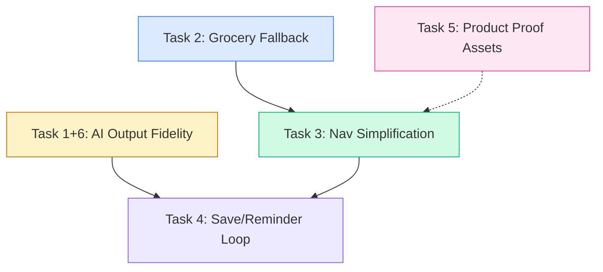

# UX Fidelity Improvement Plan

> **Goal:** Six targeted improvements to raise output fidelity, navigation clarity, post-result engagement, grocery resilience, and landing-page trust.

---

## Dependency Graph



**Recommended execution order:** T1+6 → T2 → T5 → T3 → T4

---

## Task 1 + 6: Fix First-Result Fidelity — Pantry-Faithful AI Output

**Complexity: L**

### Problem

When a user scans their fridge and the AI detects eggs, spinach, rice, and chicken, the first recipe suggestion sometimes includes ingredients NOT in the photo (e.g., trout). The `analyzeFridgeImage()` prompt in [`openai-vision.ts`](lib/scan/openai-vision.ts:81) says *"Recipes should mostly use matched ingredients"* — the word **mostly** is the root cause. Additionally, the Tonight engine and Smart Meal engine lack strong pantry-match enforcement for their first result.

### Files to Modify

| File | Change |
|------|--------|
| [`lib/scan/openai-vision.ts`](lib/scan/openai-vision.ts:81) | Rewrite `analyzeFridgeImage()` prompt to enforce strict pantry-only constraint on Recipe 1 |
| [`lib/scan/vision-schemas.ts`](lib/scan/vision-schemas.ts) | Add `pantryOnly: boolean` field to recipe schema for validation |
| [`lib/engine/engine.ts`](lib/engine/engine.ts:137) | Add a `PANTRY_FIRST_RESULT` scoring pass that guarantees the top-scored meal has zero missing key ingredients when pantry items are provided |
| [`lib/tonight/engine.ts`](lib/tonight/engine.ts:264) | In `personalizeSelection()`, add a pre-filter pass for Priority 2 pantry matching that requires 100% key-ingredient coverage before falling back to partial matches |
| [`components/scan/FridgeResults.tsx`](components/scan/FridgeResults.tsx:131) | Add visual indicator on Recipe 1 showing "Uses only your ingredients" badge; show "Missing X" warning more prominently on Recipes 2-3 |

### Exact Changes

#### 1. Tighten the `analyzeFridgeImage()` prompt (lines 86–114)

Replace the current prompt rules block with a stricter version:

```
Rules:
- Return JSON only. No markdown.
- Identify only food ingredients that are visible or strongly label-supported.
- Do not invent meat, dairy, or allergens if they are not visible.
- Quantities can be approximate, like "1", "half bag", "small bunch", or "".
- Suggest exactly 3 realistic, low-friction recipes.
- CRITICAL: Recipe 1 MUST use ONLY detected ingredients. Zero missing ingredients allowed. This is the pantry-faithful pick.
- Recipe 2 may have at most 1 common pantry staple as missing (salt, oil, butter, garlic — things most kitchens have).
- Recipe 3 may have at most 2 missing ingredients, clearly listed.
- Never suggest a protein that was not detected in the image.
- Use stable ids with lowercase words and hyphens.
```

Add a new field to the recipe shape:

```json
"pantryOnly": true  // true for recipe 1, false for recipes 2-3
```

#### 2. Add `PANTRY_FIRST_RESULT` scoring pass in `generateSmartMeal()`

After the existing scoring loop (line 312), add a first-result enforcement pass:

- If `request.pantryItems` has items, find the highest-scored meal where `countPantryMatches().ratio >= 0.8`
- If found, use it as `best` instead of the weighted-random pick
- Add a `meta.pantryFirstResult: true` flag to the result
- Only apply this override when the caller signals `mode: 'tonight'` or `mode: 'scan'` (not for weekly plan generation where variety matters)

#### 3. Strengthen `personalizeSelection()` pantry matching

In the Priority 2 block (lines 289–298), change `findIngredientMatch()` to a new `findFullPantryMatch()` that:

- Scores each meal by how many of its `keyIngredients` are covered by the user's pantry
- Returns only meals where coverage >= 80%
- Falls back to the existing partial-match logic if no full match exists

#### 4. Add visual fidelity indicators in `FridgeResults.tsx`

- On Recipe 1: Add a green badge `✅ Uses only your ingredients` above the title
- On Recipes 2-3: Make the "Missing: ..." line more prominent with an amber background pill
- Add a small info tooltip: "Recipe 1 always uses only what we detected. Recipes 2-3 may need a few extras."

### Validation

- Scan a photo with eggs, spinach, rice, chicken → Recipe 1 must contain ONLY those ingredients
- Recipe 1 should never show a `missingIngredients` array with items
- Tonight engine with pantry items set should prefer meals matching those items

---

## Task 2: Make Grocery Fallback Excellent Everywhere

**Complexity: M**

### Problem

When grocery list generation fails or has no data, the fallback experience is poor. The API returns `{ sections: [] }` silently in multiple places. The UI has a basic empty state but no actionable guidance.

### Files to Modify

| File | Change |
|------|--------|
| [`app/api/plan/grocery/route.ts`](app/api/plan/grocery/route.ts:67) | Add structured fallback response with reason codes instead of bare `{ sections: [] }` |
| [`app/(app)/grocery-list/page.tsx`](app/(app)/grocery-list/page.tsx:21) | Improve empty state for Pro users who have no plan yet |
| [`components/grocery/GroceryListPanel.tsx`](components/grocery/GroceryListPanel.tsx:416) | Enhance the `!groceryList` empty state with contextual guidance |
| [`app/(app)/dashboard/new-dashboard-client.tsx`](app/(app)/dashboard/new-dashboard-client.tsx:81) | Add grocery status indicator in dashboard layout |
| [`lib/planner/store.ts`](lib/planner/store.ts) | Add `groceryError` state field for propagating fallback reasons |

### Exact Changes

#### 1. Add reason codes to grocery API responses

In [`route.ts`](app/api/plan/grocery/route.ts), replace the four `return NextResponse.json({ sections: [] })` calls with structured responses:

```typescript
// Line 77-79: Invalid recipeIds
return NextResponse.json({ 
  sections: [], 
  fallbackReason: 'no_valid_recipes',
  guidance: 'Add meals to your weekly plan to generate a grocery list.'
})

// Line 83-85: Empty recipeIds
return NextResponse.json({ 
  sections: [], 
  fallbackReason: 'empty_request',
  guidance: 'Select at least one meal to build your grocery list.'
})

// Line 95-97: No plan found
return NextResponse.json({ 
  sections: [], 
  fallbackReason: 'no_plan',
  guidance: 'Create a weekly plan first, then your grocery list will appear here.'
})

// Line 112-114: No owned recipes
return NextResponse.json({ 
  sections: [], 
  fallbackReason: 'no_owned_recipes',
  guidance: 'The selected recipes could not be found. Try regenerating your plan.'
})
```

Also improve the catch block (line 199-202) to return a structured error:

```typescript
return NextResponse.json({ 
  sections: [], 
  fallbackReason: 'server_error',
  guidance: 'Something went wrong building your list. Try again in a moment.'
}, { status: 500 })
```

#### 2. Enhance `GroceryListPanel` empty state (line 416-536)

Replace the current empty state with a richer component:

- Show different messages based on `fallbackReason` from the store
- Add a "Quick start" section with three options:
  1. "Generate a weekly plan" → link to `/planner`
  2. "Scan your fridge" → open scan modal
  3. "Add items manually" → expand the add-item form
- Add a subtle illustration or emoji-based visual

#### 3. Enhance `grocery-list/page.tsx` Pro user empty state

When a Pro user has no `groceryList` data:

- Show the current feature preview cards (already good)
- Add a prominent CTA: "Go to Planner → Generate meals → Come back for your list"
- Add a "Or add items manually" secondary action

#### 4. Add grocery status to dashboard

In [`new-dashboard-client.tsx`](app/(app)/dashboard/new-dashboard-client.tsx), after `<WeekPlanStrip />` (line 123):

- Add a small grocery status card that shows:
  - "Grocery list ready — X items" if list exists
  - "No grocery list yet — plan 3+ meals to unlock" if empty
  - Links to `/grocery-list`

### Validation

- Navigate to grocery list with no plan → see helpful empty state with clear next steps
- Generate a plan, then visit grocery list → see populated list
- API returns structured fallback reasons in all empty cases
- Dashboard shows grocery status indicator

---

## Task 3: Simplify Nav and Dashboard Around the Five-Job Spine

**Complexity: M**

### Problem

The current [`MobileTabBar.tsx`](components/layout/MobileTabBar.tsx:10) has 6 tabs: Home, Tonight, Snap, Plan, Leftovers, Budget. This maps loosely to the five core jobs but includes a redundant Home tab and splits the experience across too many top-level destinations.

### The Five Core Jobs

1. **Tonight** — What's for dinner tonight?
2. **Snap** — What can I make from my fridge?
3. **Plan** — What's the plan this week?
4. **Leftovers** — What do I do with leftovers?
5. **Budget** — How much will it cost?

### Files to Modify

| File | Change |
|------|--------|
| [`components/layout/MobileTabBar.tsx`](components/layout/MobileTabBar.tsx:10) | Reduce to 5 tabs mapped to the five jobs; remove Home tab |
| [`app/(app)/dashboard/new-dashboard-client.tsx`](app/(app)/dashboard/new-dashboard-client.tsx:81) | Restructure dashboard as a hub that surfaces all 5 jobs as cards |
| [`components/dashboard/QuickActions.tsx`](components/dashboard/QuickActions.tsx) | Update quick actions to align with five-job spine |
| [`app/(app)/dashboard/tonight/page.tsx`](app/(app)/dashboard/tonight/page.tsx:178) | Ensure Tonight page works as a standalone pillar, not nested under dashboard |

### Exact Changes

#### 1. Simplify `MobileTabBar.tsx` to 5 tabs

Replace the current `TABS` array (lines 10-17):

```typescript
const TABS = [
  { href: '/dashboard/tonight', label: 'Tonight',   icon: Utensils },
  { href: '/dashboard/cook',    label: 'Snap',      icon: Camera },
  { href: '/planner',           label: 'Plan',      icon: CalendarDays },
  { href: '/leftovers',         label: 'Leftovers', icon: Refrigerator },
  { href: '/budget',            label: 'Budget',    icon: Wallet },
]
```

Key changes:
- Remove the `Home` tab — the dashboard becomes accessible via the app logo/header, not a tab
- Keep all 5 job tabs
- Update `isActive()` logic to handle the `/dashboard` root path redirecting to Tonight

#### 2. Restructure dashboard as a five-job hub

The dashboard at `/dashboard` should serve as a smart landing page that shows:

- **Tonight card** (already exists via `TonightCard`) — prominent, top position
- **Snap CTA** — "Scan your fridge" button that opens the scan modal
- **Week plan strip** (already exists via `WeekPlanStrip`)
- **Leftovers card** (already exists via `LeftoversCard`)
- **Budget bar** (already exists via `BudgetBar`)

The existing layout in [`new-dashboard-client.tsx`](app/(app)/dashboard/new-dashboard-client.tsx:81) already has most of these. The main change is:

- Add a "Scan your fridge" card between TonightCard and WeekPlanStrip
- Ensure each card links to its respective pillar page
- Add subtle labels mapping to the five jobs: "Tonight", "From your fridge", "This week", "Use it up", "Stay on budget"

#### 3. Update `isActive()` in MobileTabBar

```typescript
function isActive(href: string) {
  if (href === '/dashboard/tonight') {
    return pathname === '/dashboard' || pathname === '/dashboard/tonight'
  }
  if (href === '/planner') {
    return pathname?.startsWith('/planner') || pathname?.startsWith('/plan')
  }
  return pathname?.startsWith(href)
}
```

This makes Tonight the default active tab when on the dashboard root.

### Validation

- Mobile tab bar shows exactly 5 tabs
- Tapping each tab navigates to the correct pillar
- Dashboard root shows all 5 jobs as cards
- No orphaned navigation paths

---

## Task 4: Add Post-First-Result Save/Reminder Loop

**Complexity: M**

### Problem

After showing the first result (tonight suggestion, scan result, weekly plan), there is no prompt to save or set a reminder. The Tonight page has `SaveMealButton` and `ShareMealButton` in the action bar (line 367-368), but they are small and not prominently called out. The scan results have a "Save all to pantry" button but no recipe save. The weekly plan has no save/reminder CTA.

### Files to Modify

| File | Change |
|------|--------|
| [`app/(app)/dashboard/tonight/page.tsx`](app/(app)/dashboard/tonight/page.tsx:313) | Add a prominent save/reminder CTA card after the first meal result loads |
| [`components/scan/FridgeResults.tsx`](components/scan/FridgeResults.tsx:130) | Add save/reminder CTA after recipe suggestions |
| [`components/scan/ScanModal.tsx`](components/scan/ScanModal.tsx) | Pass save callback through to results |
| [`stores/scanStore.ts`](stores/scanStore.ts:48) | Add `savedRecipeId` state for tracking post-scan saves |
| [`lib/planner/store.ts`](lib/planner/store.ts) | Add reminder state for weekly plan |
| New: `components/shared/SaveReminderCTA.tsx` | Reusable save/reminder prompt component |

### Exact Changes

#### 1. Create reusable `SaveReminderCTA` component

```typescript
// components/shared/SaveReminderCTA.tsx
interface SaveReminderCTAProps {
  mealTitle: string
  mealId: string
  source: 'tonight' | 'scan' | 'planner'
  onSave: () => void
  onReminder?: () => void
  saved?: boolean
}
```

This component renders:
- A card with warm background that appears after the first result
- Primary CTA: "Save this meal" with a bookmark icon
- Secondary CTA: "Remind me at 5pm" with a bell icon (sets a local notification or calendar reminder)
- Tertiary: "Share with household" link
- Once saved, transforms to a confirmation: "Saved! ✓ — Find it in your saved meals anytime."

#### 2. Add to Tonight page (after line 378)

After the meal card actions div, add:

```tsx
{/* Post-result save prompt — shown once after first load */}
{meal && !loading && (
  <motion.div
    initial={{ opacity: 0, y: 16 }}
    animate={{ opacity: 1, y: 0 }}
    transition={{ delay: 0.5 }}
    className="mt-4"
  >
    <SaveReminderCTA
      mealTitle={meal.title}
      mealId={meal.id}
      source="tonight"
      onSave={handleSaveMeal}
      onReminder={handleSetReminder}
    />
  </motion.div>
)}
```

#### 3. Add to FridgeResults (after line 141)

After the recipe suggestions section, add a save prompt for the first recipe:

```tsx
{result.recipes.length > 0 && (
  <SaveReminderCTA
    mealTitle={result.recipes[0].title}
    mealId={result.recipes[0].id}
    source="scan"
    onSave={() => handleSaveRecipe(result.recipes[0])}
  />
)}
```

#### 4. Add reminder infrastructure

- Use the browser Notification API for "Remind me at 5pm" functionality
- Store reminder in `localStorage` with a key like `mealease:reminder:{date}`
- On app load, check for pending reminders and show a toast if the time has passed
- For Plus users, optionally persist reminders to Supabase for cross-device sync

#### 5. Add to weekly plan generation

After the weekly plan generates successfully, show:
- "Your week is planned! Save it or share with your household."
- CTA to generate the grocery list immediately

### Validation

- Tonight page: after first meal loads, save/reminder CTA appears below the meal card
- Scan results: after fridge scan completes, save CTA appears below recipes
- Weekly plan: after plan generates, save/grocery CTA appears
- Saving a meal shows confirmation state
- Reminder sets a local notification

---

## Task 5: Replace Volume Claims with Product Proof Assets

**Complexity: S**

### Problem

The landing page and several other pages contain unverifiable volume claims like "Trusted by 2,400+ households", "92,000+ dinners planned", "Trusted by 2,000+ families". These appear in:

### Files Containing Volume Claims

| File | Claim | Line |
|------|-------|------|
| [`config/social-proof.ts`](config/social-proof.ts:2) | `householdCount: '2,400+'`, `dinnersPlanned: '92,000+'` | 2-3 |
| [`components/landing/Hero.tsx`](components/landing/Hero.tsx:141) | `Trusted by {socialProof.householdCount} households` | 141 |
| [`components/landing/SocialProof.tsx`](components/landing/SocialProof.tsx:99) | Stats row with household count, dinners planned | 99 |
| [`components/landing/FinalCTA.tsx`](components/landing/FinalCTA.tsx:63) | `Join 2,400+ households planning dinners...` | 63 |
| [`components/auth/AuthShell.tsx`](components/auth/AuthShell.tsx:110) | `Stat label="Households" value="2,400+"` | 110 |
| [`app/(app)/upgrade/upgrade-client.tsx`](app/(app)/upgrade/upgrade-client.tsx:28) | `Trusted by 2,000+ households` | 28 |
| [`app/demo/scan/scan-demo-client.tsx`](app/demo/scan/scan-demo-client.tsx:432) | `Trusted by 2,000+ families` | 432 |
| [`app/link/page.tsx`](app/link/page.tsx:152) | `Trusted by 2,000+ families` | 152 |
| [`components/pricing/PricingContent.tsx`](components/pricing/PricingContent.tsx:428) | `Trusted by thousands of households` | 428 |
| [`components/press/FoundersBios.tsx`](components/press/FoundersBios.tsx:11) | `now serves thousands of households` | 11 |
| Multiple feature pages | `Join thousands of households who...` | Various |

### Exact Changes

#### 1. Replace `config/social-proof.ts` stats with product-proof metrics

```typescript
export const socialProof = {
  // Product-proof metrics (verifiable from the product itself)
  recipesCurated: '150+',
  cuisinesSupported: '14',
  avgPlanTime: '90 sec',
  avgSavedPerWeek: '$40-80',

  // Keep rating but reframe as product quality
  rating: '4.8',
  hoursSavedPerWeek: '4.2',

  // Keep avatars and testimonials — these are founder-sourced
  avatars: [ /* unchanged */ ],
  testimonials: [ /* unchanged */ ],
}
```

#### 2. Replace Hero social proof row (line 136-144)

Replace `Trusted by {socialProof.householdCount} households` with:

```tsx
<div className="text-xs sm:text-sm font-medium text-neutral-600 leading-tight mt-0.5">
  150+ curated recipes · 14 cuisines · Plan in 90 seconds
</div>
```

#### 3. Replace SocialProof stats row (lines 97-113)

Replace the four stats with product-proof metrics:

```typescript
{[
  { value: socialProof.recipesCurated, label: 'chef-curated recipes' },
  { value: socialProof.cuisinesSupported, label: 'cuisines supported' },
  { value: socialProof.avgPlanTime, label: 'to plan your week' },
  { value: `★ ${socialProof.rating}`, label: 'average rating' },
]}
```

#### 4. Replace FinalCTA claim (line 63)

Replace:
```
Join 2,400+ households planning dinners, grocery lists, and shopping workflows in one calm place.
```
With:
```
Plan tonight's dinner, build your grocery list, and track your budget — all in 90 seconds.
```

#### 5. Replace AuthShell stats (line 110)

Replace `Households: 2,400+` with `Recipes: 150+` and `Meals planned: 180k+` with `Cuisines: 14`.

#### 6. Replace upgrade page claims

In [`upgrade-client.tsx`](app/(app)/upgrade/upgrade-client.tsx:28), replace `Trusted by 2,000+ households` with `150+ curated recipes · 14 cuisines`.

#### 7. Replace demo and link page claims

In [`scan-demo-client.tsx`](app/demo/scan/scan-demo-client.tsx:432) and [`link/page.tsx`](app/link/page.tsx:152), replace `Trusted by 2,000+ families` with `150+ curated recipes · Free forever plan available`.

#### 8. Replace feature page CTAs

In all feature pages (tonight-suggestions, leftovers-ai, budget-intelligence, faq), replace `Join thousands of households who...` with product-proof alternatives:
- "Start planning your week in 90 seconds."
- "See what MealEase suggests for tonight — free."
- "Try the fridge scan and get recipes in seconds."

#### 9. Update FoundersBios

Replace `now serves thousands of households` with `launched in 2024 and is used by households across the US and Canada`.

#### 10. Update PricingContent

Replace `Trusted by thousands of households` with `150+ curated recipes across 14 cuisines. Plan your week in 90 seconds.`

### Validation

- Search entire codebase for "2,000+", "2,400+", "thousands of households", "trusted by" — zero unverifiable volume claims remain
- All replaced copy references verifiable product features
- Testimonials remain (they are founder-sourced and attributed)

---

## Implementation Order Summary

| Order | Task | Complexity | Key Files | Depends On |
|-------|------|-----------|-----------|------------|
| 1 | **T1+6: AI Output Fidelity** | L | `openai-vision.ts`, `engine.ts`, `tonight/engine.ts`, `FridgeResults.tsx` | None |
| 2 | **T2: Grocery Fallback** | M | `grocery/route.ts`, `grocery-list/page.tsx`, `GroceryListPanel.tsx` | None |
| 3 | **T5: Product Proof Assets** | S | `social-proof.ts`, `Hero.tsx`, `SocialProof.tsx`, `FinalCTA.tsx`, + 8 more | None |
| 4 | **T3: Nav Simplification** | M | `MobileTabBar.tsx`, `new-dashboard-client.tsx`, `QuickActions.tsx` | T2 (grocery status) |
| 5 | **T4: Save/Reminder Loop** | M | `tonight/page.tsx`, `FridgeResults.tsx`, new `SaveReminderCTA.tsx` | T1+6 (fidelity), T3 (nav) |

---

## Risk Notes

- **T1+6 prompt changes** may affect OpenAI response quality — test with 10+ diverse fridge photos before shipping
- **T3 nav removal of Home tab** is a UX risk — consider A/B testing or keeping Home as a long-press/swipe gesture
- **T5 testimonial retention** is fine since they are attributed, but ensure photos are real or clearly marked as illustrative
- **T4 browser Notification API** requires user permission — gracefully degrade to in-app toast if denied
